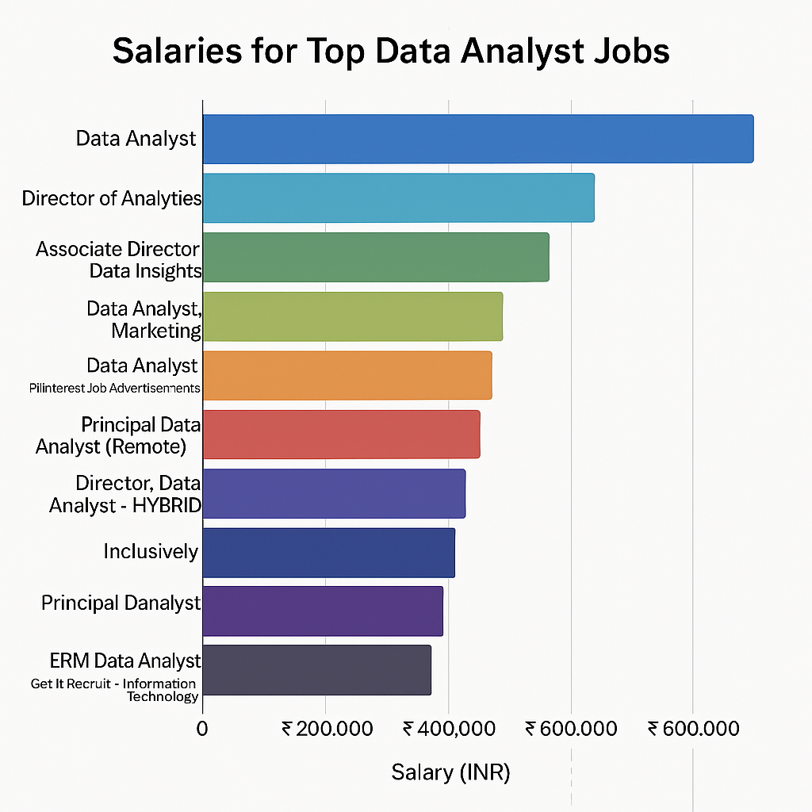

# Introduction
Dive into the data job market! Focusing on data analyst roles, this project explores top-paying jobs, in-demand skills, and where high demand meets high salary in data analytics.

SQL queries? Check them out here: [project_sql folder](/project_sql/) 

# Background
Driven by a quest to navigate the data analyst job market more effectively, this project was born from a desire to pinpoint top-paid and in-demand skills, streamlining others work to find optimal jobs.

### The questions I wanted to answer through my SQL queries were:


1. What are the top-paying data analyst jobs?

2. What skills are required for these top-paying jobs?

3. What skills are most in demand for data analysts?

4. Which skills are associated with higher salaries?

5. What are the most optimal skills to learn?

# Tools I used

For my deep dive into the data analyst job market, I harnessed the power of several key tools:

- **SQL:** The backbone of my analysis, allowing me to query the database and unearth critical insights.


- **PostgreSQL:** The chosen database management system, ideal for handling the job posting data.


- **Visual Studio Code:** My go-to for database management and executing SQL queries.

 - **Git & GitHub:** Essential for version control and sharing my SQL scripts and analysis, ensuring collaboration and project tracking. 

# The Analysis
Each query for this project aimed at investigating specific aspects of the data analyst job market.

Here's how I approached each question:


### 1. Top Paying Data Analyst Jobs
To identify the highest-paying roles, I filtered data analyst positions by average yearly salary and location, focusing on remote jobs. This query highlights the high paying opportunities in the field.
``` sql
SELECT
    job_id,
    job_title,
    job_location,
    job_schedule_type,
    salary_year_avg,
    cd.name as company_name,
    job_posted_date
From 
    job_postings_fact as jpf
LEFT JOIN company_dim as cd
on jpf.company_id=cd.company_id
WHERE 
    job_title_short='Data Analyst' and 
    job_location='Anywhere' and 
    salary_year_avg IS NOT NULL
ORDER BY 
    salary_year_avg DESC
limit 10;
```
Here's the breakdown of the top data analyst jobs :

- **Wide Salary Range:** Top 10 paying data analyst roles span from $184,000 to $650,000, indicating significant salary potential in the field.

- **Diverse Employers:** Companies like SmartAsset, Meta, and AT&T are among those offering high salaries, showing a broad interest across different industries.

- **Job Title Variety:** There's a high diversity specializations within data analytics. in job titles, from Data Analyst to Director of Analytics, reflecting varied roles andand specialization within data analytics

 
*Bar graph visualizing the the salary of top 10 salaries for data analysts.*

### 2. Skills for Top Paying Jobs
 To understand what skills are required for the top-paying jobs, I joined the job postings with the skills data, providing insights into what employers value for high-compensation roles.

 ``` sql
 
with top_paying_jobs as (

SELECT
    job_id,
    job_title,
    job_location,

    salary_year_avg,
    cd.name as company_name
  
From 
    job_postings_fact as jpf
LEFT JOIN company_dim as cd
on jpf.company_id=cd.company_id
WHERE 
    job_title_short='Data Analyst' and 
    job_location='Anywhere' and 
    salary_year_avg IS NOT NULL
ORDER BY 
    salary_year_avg DESC
limit 10
)
select 
    top_paying_jobs.*,
    skills
from top_paying_jobs
INNER JOIN skills_job_dim on top_paying_jobs.job_id=skills_job_dim.job_id
INNER JOIN skills_dim 
    ON skills_job_dim.skill_id = skills_dim.skill_id
ORDER BY 
    salary_year_avg DESC

 ```
Here are the top insights from the skills column for the top 10 highest-paying Data Analyst roles:
SQL is the top-listed skill (8/10 jobs), emphasizing its critical role in querying and managing data in nearly all analyst positions.

Python (7 mentions) is highly sought after for its versatility in data analysis, automation, and machine learning. Combined with Pandas (3 mentions), it's clear Python's ecosystem is favored.

Tableau (6 mentions) shows that data visualization skills are just as important as analytical abilities.

R (4 mentions) still holds relevance, particularly in roles requiring statistical analysis and modeling.

Snowflake, Excel, and Pandas reflect the need for comfort with both cloud-based and traditional data tools.

Azure and Bitbucket indicate a shift toward cloud infrastructure and version control, suggesting that data analysts are increasingly expected to work in tech-driven, collaborative environments.

Go, while not typically associated with analyst roles, suggests some companies are valuing analysts who can interact with backend or system-level codebases, possibly in more technical or hybrid roles.


*Bar graph visualizing the top 10 skills for data analysts.*

### 3. In-Demand Skills for Data Analysis

This query helped identify the skills most frequently requested in job postings, directing focus to areas with high demand.
```sql
select 
    skills,
    count(skills_job_dim.job_id) as demand_count
from job_postings_fact
INNER JOIN skills_job_dim on job_postings_fact.job_id=skills_job_dim.job_id
INNER JOIN skills_dim 
    ON skills_job_dim.skill_id = skills_dim.skill_id
WHERE
    job_title_short= 'Data Analyst' AND
    job_location= 'India'
GROUP BY   skills
    order BY demand_count desc
    limit 5

```
Here's the breakdown of the most demanded skills for data analysts in 2023

SQL and Excel remain fundamental, emphasizing the need for strong foundational skills in data processing and spreadsheet manipulation.

Programming and Visualization Tools like Python, Tableau, and Power BI are essential, pointing towards the increasing importance of technical skills in data storytelling and decision support

 

| Skill     | Demand Count |
|-----------|--------------|
| SQL       | 7,291        |
| Excel     | 4,611        |
| Python    | 4,330        |
| Tableau   | 3,745        |
| Power BI  | 2,609        |

*Table of the demand for the top 5 skills in data analyst job postings*

### 4. Skills Based on Salary
Exploring the average salaries associated with different skills revealed which skills are the highest paying
```sql
select 
    skills,
    round (avg(salary_year_avg), 0 )as avg_salary
from job_postings_fact
INNER JOIN skills_job_dim on job_postings_fact.job_id=skills_job_dim.job_id
INNER JOIN skills_dim 
    ON skills_job_dim.skill_id = skills_dim.skill_id
WHERE
    job_title_short= 'Data Analyst' 
    and salary_year_avg is not null
    AND job_location= 'Anywhere'
    and job_work_from_home= true
GROUP BY   skills
    order BY avg_salary desc
    limit 30


```
1. 🧠 Specialized/Enterprise Tools Drive High Pay
Tools like PySpark, DataRobot, and Watson top the list — reflecting the high value placed on big data, ML automation, and AI platforms in modern analytics roles.

These often relate to enterprise-scale data pipelines, which command premium salaries due to complexity and fewer experts.

2. 💻 Version Control & DevOps Integration
Tools like Bitbucket, GitLab, Jenkins, and Atlassian indicate that DevOps skills are becoming more integrated into analytics roles.

Analysts who can work with CI/CD systems or collaborate with engineering teams earn more.

3. 🔬 ML & Scientific Computing Libraries
Pandas, Numpy, Scikit-learn, Jupyter notebooks — all reflect the growing demand for data science and machine learning skills.

These skills link analytics work with modeling, experimentation, and automation, boosting pay.

4. ☁️ Cloud & Distributed Systems
GCP, Airflow, Kubernetes, Databricks, and Hadoop show that cloud-native analysts and data engineers are highly compensated.

The ability to deploy data pipelines and work on distributed systems is key to upper-tier roles.

5. 🧰 Less Common, Niche Tools Pay Well
Tools like Couchbase, Crystal, Twilio, and MicroStrategy suggest that niche skills often lead to less competition and higher pay — especially in companies where those tools are core to infrastructure.

6. 🛠️ Cross-functional Collaboration
Tools like Confluence, Notion, and Atlassian reflect the importance of documentation, project management, and collaboration platforms — increasingly expected even in technical roles.

| Skill          | Average Salary (USD) |
|----------------|-----------------------|
| PySpark        | 208,172              |
| Bitbucket      | 189,155              |
| Watson         | 160,515              |
| Couchbase      | 160,515              |
| DataRobot      | 155,486              |
| GitLab         | 154,500              |
| Swift          | 153,750              |
| Jupyter        | 152,777              |
| Pandas         | 151,821              |
| Elasticsearch  | 145,000              |
*Top Paying Skills for Data Analysts*

### 5. Most Optimal Skills to Learn

Combining insights from demand and salary data, this query aimed to pinpoint skills that are both in high demand and have high salaries, offering a strategic focus for skill development.

``` sql
with skills_demand as (
    select 
         skills_dim.skill_id,
        skills_dim.skills,
        count(skills_job_dim.job_id) as demand_count
    from job_postings_fact
    INNER JOIN skills_job_dim on job_postings_fact.job_id=skills_job_dim.job_id
    INNER JOIN skills_dim 
        ON skills_job_dim.skill_id = skills_dim.skill_id
    WHERE
        job_title_short= 'Data Analyst' AND
        job_location= 'Anywhere' 
        and salary_year_avg is not null
    GROUP BY   skills_dim.skill_id
   
     
), avg_salary as (
    select 
         skills_job_dim.skill_id,
        round (avg(job_postings_fact.salary_year_avg), 0 )as avg_salary
    from job_postings_fact
    INNER JOIN skills_job_dim on job_postings_fact.job_id=skills_job_dim.job_id
    INNER JOIN skills_dim 
        ON skills_job_dim.skill_id = skills_dim.skill_id
    WHERE
        job_title_short= 'Data Analyst' 
        and salary_year_avg is not null
        AND job_location= 'Anywhere'
        and job_work_from_home= true
    GROUP BY   skills_job_dim.skill_id

    
)
select
    skills_demand.skill_id,
    skills_demand.skills,
    demand_count,
    avg_salary
from
    skills_demand
Inner JOIN avg_salary on skills_demand.skill_id=avg_salary.skill_id

ORDER BY
    avg_salary,
    demand_count DESC
limit 30
```
Here's a breakdown of the most optimal skills for Data Analysts:

High-Demand Programming Languages: Python and R stand out for their high demand, with demand counts of 236 and 148 respectively. Despite their high demand, their average salaries are around $101,397 for Python and $100,499 for R, indicating that proficiency in these languages is highly valued but also widely available.

Cloud Tools and Technologies: Skills in specialized technologies such as Snowflake, Azure, AWS, and BigQuery show significant demand with relatively high average salaries, pointing towards the growing importance of cloud platforms and big data technologies in data analysis.

Business Intelligence and Visualization Tools: Tableau and Looker, with demand counts of 230 and 49 respectively, and average salaries around $99,288 and $103,795, highlight the critical role of data visualization and business intelligence in deriving

actionable insights from data.

Database Technologies: The demand for skills in traditional and NoSQL databases (Oracle, SQL Server, NoSQL) with average salaries ranging from $97,786 to $104,534, reflects the enduring need for data storage, retrieval, and management expertise.

# What I learned
Throughout this adventure, I've turbocharged my SQL toolkit with some serious firepower:

- **Complex Query Crafting:** Mastered the art of advanced SQL, merging tables like a pro and wielding WITH clauses for ninja-level temp table maneuvers.


- **Data Aggregation:** Got cozy with GROUP BY and turned aggregate functions like COUNT() and AVG () into my data-summarizing sidekicks.

- **Analytical Wizardry:** Leveled up my real-world puzzle-solving skills, turning questions into actionable, insightful SQL queries.

# Conclusion
### Insights

From the analysis, several general insights emerged:


1. **Top-Paying Data Analyst Jobs**: The highest-paying jobs for data analysts that allow remote work offer a wide range of salaries, the highest at $650,000!


2. **Skills for Top-Paying Jobs**: High-paying data analyst jobs require advanced proficiency in SQL, suggesting it's a critical skill for earning a top salary.


3. **Most In-Demand Skills**: SQL is also the most demanded skill in the data analyst job market, thus making it essential for job seekers.


4. **Skills with Higher Salaries**: Specialized skills, such as SVN and Solidity, are associated with the highest average salaries, indicating a premium on niche expertise.


5. **Optimal Skills for Job Market Value**: SQL leads in demand and offers for a high average salary, positioning it as one of the most optimal skills for data analysts to learn to maximize their market value.

### Closing Thoughts

This project enhanced my SQL skills and provided valuable insights into the data analyst job market. The findings from the analysis serve as a guide to prioritizing skill development and job search efforts. Aspiring data analysts can better position themselves in a competitive job market by focusing on high-demand, high-salary skills. This exploration highlights the importance of continuous learning and adaptation to emerging trends in the field of data analytics